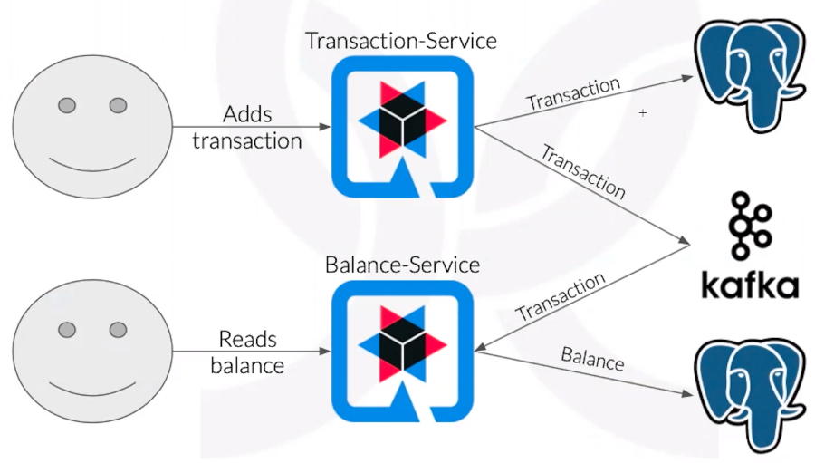

# Command Query Responsibility Segregation (CQRS) Archtecture

We should read information differently than we store information.    
The bank-account project uses the CQRS principle, becauses balances are read more often than transactions are performed

According with [Martin Folwer](https://martinfowler.com/bliki/CQRS.html):
> At its heart is the notion that you can use a different model to update information than the model you use to read information. 
> For some situations, this separation can be valuable, but beware that for most systems CQRS adds risky complexity.

# Structuring the application

## Infrastructure

Disclaimer: We will not use automation for every proccess (such as creating databases) because this project main purpose is being didatic. Because of this, we will not worry much about security issues. A more proffessional-level project can be implemented later.

### Database

1. Create a database instance in your favorite cloud provider. I am using PostgreSQL in AWS service RDS (Relational Database Service).

### Elastic Kubernetes Service (EKS)

1. Create an EKS cluster in your favorite cloud provider. Mine is called cluster-bank-account-test hosted in AWS.
